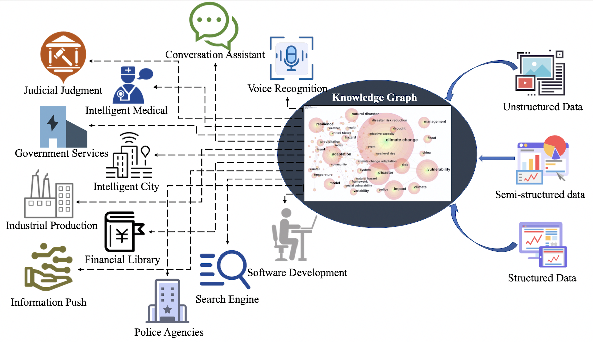
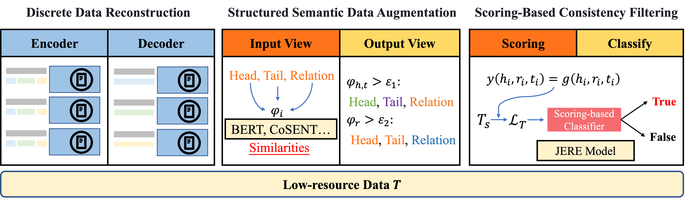
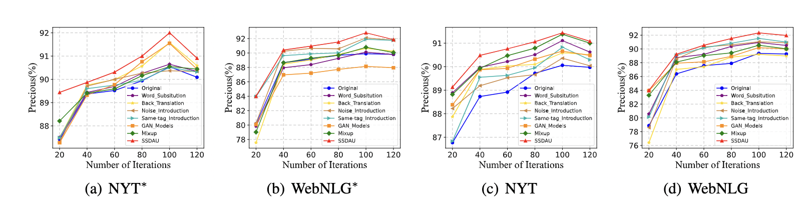
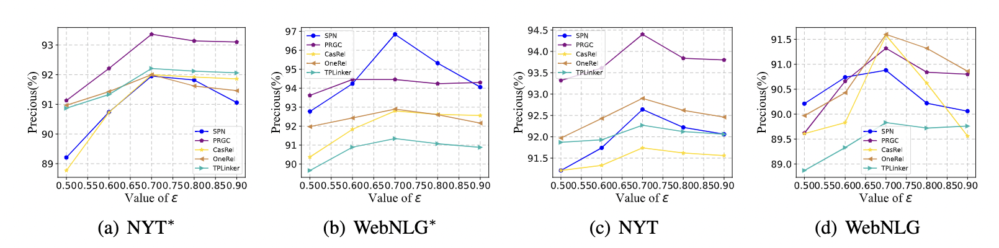
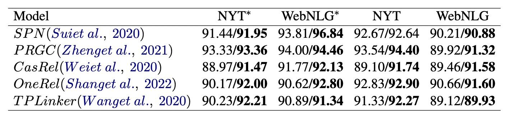

# **Introduction**
## **Data_Augmentation**
The **Data_Augmentation** file stores the data augmentation process of **SSDAU**, and the detailed usage process can be found in the **Data_Augmentation/README.md** file.  
The data augmentation process can be reproduced by following the steps in the **Data_Augmentation/README.md**.
## **Experiment_Model**
The **Experiment_Model** file stores five JERE models (**PRGC, CasRel, OneRel, TPLinker, SPN**), which can be reproduced according to the **Experiment_Model/README.md** file.
## **Baselines**
Six data augmentation baselines (**Word Substitution, Back Translation, Noise Introduction, Same-tag Semantic Noise, Generative Models, Mixup**) are stored in the **Baselines** file.

# **Background**
As a subtask of information extraction, joint entity and relation extractio (**JERE**) serves as a critical building block for information retrieval, question answering and text summarization systems, etc.

# **SSDAU**
**SSDAU** contains three essential components: (1)) **Discrete Data Reconstruction Component**, (2) **Structured Semantic Data Augmentation Component**, and (3) **Scoring-Based Consistency Filtering Component**. They are responsible for text semantic segmentation and reconstruction, structured semantic data augmentation, and filtering of augmented data pairs, respectively.

# **Result**
We compare with the six most representative data augmentation methods and the results show that our method refreshes all baselines.

We choose the optimal semantic matching threshold.

We validate the effectiveness in different JERE models.

